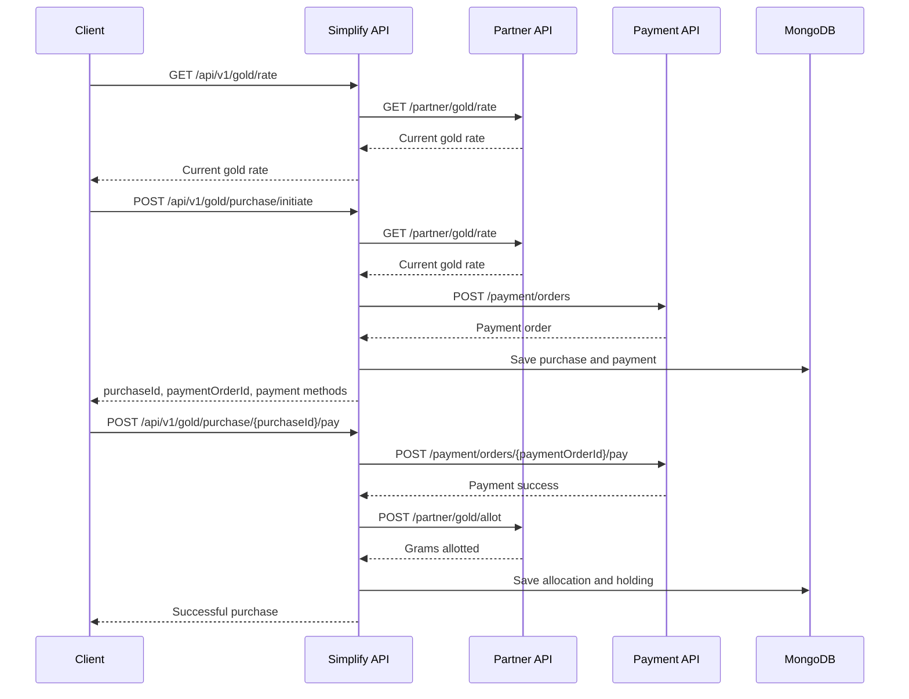

# Simplify Money Digital Gold Backend Assignment

This project emulates the Simplify Money digital gold purchase flow from a backend perspective.

## Backend Analysis of the Digital Gold Flow

From the app flow described in the assignment, the backend needs to support these steps:

1. The app shows current digital gold buy/sell price.
2. The user enters an amount such as INR 10.
3. The backend creates a purchase intent and locks the rate used for this purchase.
4. The backend asks the payment gateway for supported payment options.
5. The user completes payment through a selected method.
6. After payment success, the backend calls the gold partner to allot equivalent grams.
7. The portfolio shows total grams, invested amount, current value, and gain/loss percentage.

The important backend concern is orchestration. Simplify Money API should not directly fake the whole flow. It should persist local state and call the mocked Partner Gold API and Payment Gateway API over HTTP.

It contains three HTTP services:

| Service | Port | Responsibility |
| --- | --- | --- |
| Simplify Money API | 8090 on host, 8080 in container | Main backend that orchestrates gold purchase, payment, allotment, portfolio, persistence, logging, and tracing |
| Partner Gold API | 8081 | Mock partner service for current gold rate and gold allotment |
| Payment Gateway API | 8082 | Mock gateway for payment methods, payment order creation, and payment execution |

## Tech Stack

- Java 17
- Spring Boot 3
- Spring Web MVC
- WebClient for service-to-service calls
- MongoDB
- Spring Validation
- Spring Boot Actuator
- Springdoc OpenAPI / Swagger
- Docker Compose
- JUnit/Mockito-ready test setup

## Flow



## Run

Fastest path: install only Docker Desktop. The Dockerfiles build the Java services inside Maven/JDK containers.

```bash
docker compose up --build
```

If you also have JDK 17 and Maven installed locally, you can run tests first:

```bash
mvn test
```

Swagger:

- Simplify API: http://localhost:8090/swagger-ui.html
- Partner API: http://localhost:8081/swagger-ui.html
- Payment API: http://localhost:8082/swagger-ui.html

Health:

- http://localhost:8090/actuator/health
- http://localhost:8081/actuator/health
- http://localhost:8082/actuator/health

## Sample API Calls

Fetch current gold rate:

```bash
curl -H "X-Request-Id: demo-req-1" http://localhost:8090/api/v1/gold/rate
```

Fetch payment methods:

```bash
curl -H "X-Request-Id: demo-req-2" http://localhost:8090/api/v1/payment-methods
```

Initiate purchase:

```bash
curl -X POST http://localhost:8090/api/v1/gold/purchase/initiate \
  -H "Content-Type: application/json" \
  -H "X-Request-Id: demo-req-3" \
  -H "Idempotency-Key: purchase-demo-1" \
  -d '{"userId":"USER_1","amount":10}'
```

Pay:

```bash
curl -X POST http://localhost:8090/api/v1/gold/purchase/{purchaseId}/pay \
  -H "Content-Type: application/json" \
  -H "X-Request-Id: demo-req-4" \
  -d '{"paymentMethod":"UPI"}'
```

Portfolio:

```bash
curl http://localhost:8090/api/v1/portfolio/USER_1
```

## Persistence

MongoDB collections used by Simplify Money API:

- `gold_purchases`
- `payments`
- `gold_holdings`
- `audit_events`

## Main Simplify API Endpoints

- `GET /api/v1/gold/rate` - fetch current gold buy/sell rate from Partner Gold API.
- `GET /api/v1/payment-methods` - fetch available methods from Payment Gateway API.
- `POST /api/v1/gold/purchase/initiate` - create purchase and payment order.
- `POST /api/v1/gold/purchase/{purchaseId}/pay` - execute payment and allot gold.
- `POST /api/v1/gold/purchase/{purchaseId}/cancel` - cancel a pending unpaid purchase.
- `GET /api/v1/gold/purchases/{purchaseId}` - fetch one purchase.
- `GET /api/v1/gold/purchases/user/{userId}` - list user purchases.
- `GET /api/v1/gold/holdings/{userId}` - fetch stored holding summary.
- `GET /api/v1/portfolio/{userId}` - fetch holding with current valuation and gain/loss.

## Production-Grade Basics Included

- Controller validation with Jakarta Validation
- Global exception handler
- Purchase status lifecycle
- Idempotency support for purchase initiation
- Correlation/request ID filter
- Request ID propagation to downstream APIs
- Service-to-service calls through WebClient
- Actuator health endpoints
- Swagger/OpenAPI docs
- Structured domain logging with requestId, userId, purchaseId, and statuses

## Assumptions

- Partner gold rate and payment gateway behavior are mocked, as allowed in the assignment.
- The interaction between services is real HTTP, not in-memory mocking.
- Authentication is intentionally excluded to keep the assignment focused on backend orchestration.
- Payment success is mocked by Payment Gateway API unless the request chooses a failure method.
